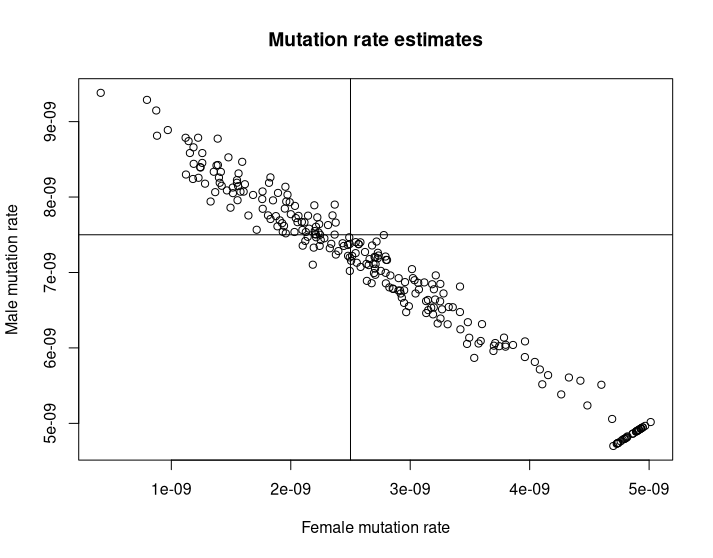

# RohMut

This R packages estimates the sex-specific mutation rate based from runs of homozygosity(ROH) segments from close common ancestor (Parents should be either first or second cousins).

We assume that the number of mutations in each generation is a Poisson process, with the rate depending on the sex of the ancestor.

Looking for example at the offspring of a first cousin, there are three possible pedigrees - Either the grand grandparents had two daughters/sons and those are the grandparents of the individual, or they had one daughter and one son, and they are the grandparents of the individual. We assume exchangeability so the probability of two sons is 0.25, one son and one daughter is 0.5, and of two daughters is 0.25. Finally, each segment came from either the grand grandmother or grand grandfather with equal probability (actually due to the different recombination rate, the probability is slightly different from 0.5, but we assume it's 0.5).

We get the hierarchical mixture model:

$$\sum_i^n \sum_{\text{First/second cousin}} P(\text{i is offspring of First/second cousin}) \cdot \sum_{a} P(\text{a is this specific pedigree length}) \sum_{s}^{S_i} 0.5 \text{Pois}(\text{segment s length * (genotyping error rate + (n^f_{a, s}+1) * female mutation rate + (n^m_{a, s} - 1) * male mutation rate)}) + 0.5 \text{Pois}(\text{segment s length * (genotyping error rate + (n^f_{a, s} - 1) * female mutation rate + (n^m_{a, s} + 1) * male mutation rate)})$$

The likelihood is maximized through a variation of the Expectation maximization algorithm (EM).
Note that the likelihood is symmetric with respect to the mutation rate, so after the estimation if the recombination rate is provided, we use it to select which of the parameters is the male's mutation rate and which is the female's based on the probability of recombination.

## Installation

To install using the devtools package:

```R
# If devtools is not available, install it first
# install.packages("devtools")
devtools::install_github("Lirazk/RohMut")
```
## Quick start

```R
library(RohMut)

data("fs_cousins", package = "RohMut")
data("prob_model", package = "RohMut")

fs_cousins <- data.table(fs_cousins)

probs <- predict(model, fs_cousins[, .N, by = subject], type = "response")

fs_cousins[, mutation := rpois(nrow(fs_cousins), length * (1e-8 + 2.5e-9 * (Nf - male_meiosis) + 7.5e-9 * (Nm + male_meiosis)))]
SQUAREM::squarem(c(1e-8, 2e-8, 1e-7), 
          function(theta) RohMut::estimate_EM(fs_cousins, theta, probs, maxit = 1, estimate_intercept = T), 
      control = list(tol=1e-15))
```

Estimates from 250 runs, with known genotyping error:

